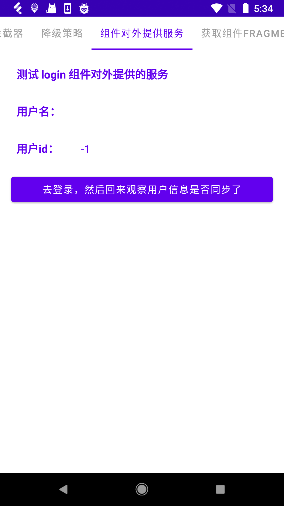

## 注意
- 本项目只用于学习，不用于生产。
- 项目中代码以简单易懂为主。
- 在看懂本项目的情况下，再去看其他的开源库会轻松很多。

### 项目app预览

  

  


### 功能实现原理

[组件跳转](组件跳转.md)

[组件路由懒加载](组件路由懒加载.md)

[注解处理器](注解处理器要点.md)

[参数传递与注入](参数传递与注入.md)

[跳转拦截器](跳转拦截器.md)

[组件提供外部服务](组件提供外部服务.md)

[组件独立运行](组件独立运行.md)

[组件代码隔离](组件代码隔离.md)

[组件之间公用代码下沉问题解决方案](组件之间公用代码下沉问题解决方案.md)


### 项目如何运行
- 如果你在项目里面使用了插件注册的方式，如下

    ```java
    BRouter.init(this, true);
    ```

    **需要注意：** 因为有gradle插件，且工程使用的是本地maven依赖，所以需要先将 `brouter_api` 的插件发布出来，然后才能使用。
    点击 brouter_api -> Tasks -> upload -> uploadArchives 即可将插件发布到项目下的 maven/repository  仓库里面，然后项目即可正常编译。
    
    然后，将 app 下的 build.gradle 的 `//apply plugin: 'brouter'` 这行注释打开
    
- app 里面使用了代码隔离插件，所以也需要先将该插件发布到本地（发布的时候，可以先将对应的使用到该插件代码的位置注释掉，否则会无法同步）：
  
    点击 code-isolation -> Tasks -> upload -> uploadArchives 即可将插件发布到项目下的 maven/repository  仓库里面，然后项目即可正常编译。
