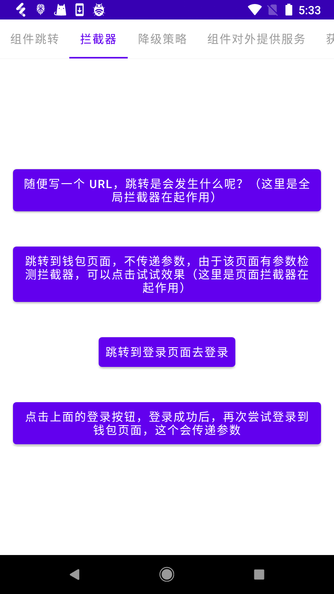

BRouter 是一个**学习项目组件化**的开源项目。

项目里面尽量使用最简单的代码来实现组件化的功能，实现的原理会参考其他开源项目，比如，ARouter，这也是这个项目叫做 BRouter 的原因，不过随着项目功能的扩展，实现原理已经不仅仅局限于 ARouter 了。

项目里面不仅实现了功能，还分析了其他开源下项目的实现原理，而且还将实现过程记录为文档，便于理解。


### 项目app预览

  

  

  

### 项目如何运行

- 如果你在项目里面使用了插件注册的方式，如下

    ```java
    BRouter.init(this, true);
    ```

    **需要注意：** 因为有gradle插件，且工程使用的是本地maven依赖，所以需要先将 `brouter_api` 的插件发布出来，然后才能使用。
    点击 brouter_api -> Tasks -> upload -> uploadArchives 即可将插件发布到项目下的 maven/repository  仓库里面，然后项目即可正常编译。
    
    然后，将 app 下的 build.gradle 的 `//apply plugin: 'brouter'` 这行注释打开
    
- app 里面使用了代码隔离插件，所以也需要先将该插件发布到本地（发布的时候，可以先将对应的使用到该插件代码的位置注释掉，否则会无法同步）：
  
    点击 code-isolation -> Tasks -> upload -> uploadArchives 即可将插件发布到项目下的 maven/repository  仓库里面，然后项目即可正常编译。


### 功能实现原理

1. [组件跳转](组件跳转.md)

2. [组件路由懒加载](组件路由懒加载.md)

3. [参数传递与注入](参数传递与注入.md)


4. [组件的生命周期分发](组件的生命周期分发.md)

5. [跳转拦截器](跳转拦截器.md)

6. [组件提供外部服务](组件提供外部服务.md)

7. [获取组件Fragment](获取组件Fragment.md)


8. [组件独立运行](组件独立运行.md)

9. [组件代码隔离](组件代码隔离.md)

10. [组件之间公用代码下沉问题解决方案](组件之间公用代码下沉问题解决方案.md)


11. [注解处理器](注解处理器要点.md)

