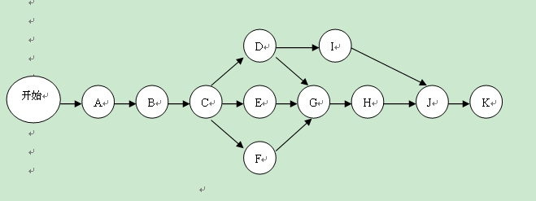

### 启动任务依赖解决方案

在应用启动的时候，会有很多的东西需要初始化，一般情况下，我们是将这些任务都放在了主线程中的，这样就会导致启动较慢。

有的解决方案，就是将这些初始化代码都放入子线程中，那么问题来了：

- 使用几个子线程呢？使用一个子线程的话，肯定不行，和在主线程中没啥区别。
- 使用多个子线程的话，如何计算线程个数？初始化代码怎么分到各个线程中？
- 初始化代码（Task）之间有顺序该怎么处理？

### 开源解决方案

线程个数可以直接使用线程池，就不用关心这个问题了。

依赖顺序问题，有两中解决方案，一个是拓扑排序，一个是PERT网路图。

[alpha](https://github.com/alibaba/alpha) 项目使用的是 PERT 图的方式，代码好理解，有及其详细的注释，牛逼。

[AppStartFaster](https://github.com/NoEndToLF/AppStartFaster) 项目使用的是拓扑排序的方式，只需要搞清楚拓扑排序算法就行，代码也好理解。

在分析源码的过程中，发现了 alpha 有个不算缺点的缺点，在有些 task 运行在主线程的时候，在主线程调用 waitUntilFinish 方法的时候会导致死锁。因为我们的项目里面，还没有遇到说某个库的初始化必须放在主线程的，所以这个对我们现在来说不算缺点。

AppStartFaster 没有这个缺点，因为它调用 wait 的时候，锁的位置不一样，所以没有这个问题。但是它有自己不足的地方，它会一下子将所有运行在子线程的 task 全部放入线程池，由于还有前置依赖的 task 并不能立即执行（处于 wait 状态），所以相当于浪费了线程资源。

BRouter 是简化了 alpha 的代码，删去了一些功能，然后优化了上面说的死锁问题，下面先分析代码，后面再说如何解决死锁问题。

### 代码分析

#### 紧前 与 紧后

> com.aprz.graph.task.Task
>
> 抽象了一个 Task 类，这个类里面可以放入初始化代码，也没必要每个初始化库搞一个 Task，耗时比较长的可以单独搞一个，一些简单的初始化可以放在一起。

```java
    /**
     * 该任务的“紧后”任务
     */
    private final Set<Task> successorList = new HashSet<>();

    /**
     * 该任务的“紧前”任务
     */
    protected Set<Task> predecessorSet = new HashSet<>();

```

这两个变量非常重要，现在介绍一下“紧前”与“紧后”任务。比如，有一个 TaskA，一个 TaskB。TaskB 必须在 Task A 之后执行，那么 TaskA 是 TaskB 的“紧前”任务，TaskB 是 TaskA 的“紧后“任务。注意，“紧前”与“紧后”还意味着，这两个任务是”挨着的“，看下面的图：



C 也是在 A 之后执行，但是 C 不是 A 的 ”紧后“，C 是 B 的 ”紧后“。

这两个概念一介绍，大致的思路应该就有了：

- 某个任务一执行完，它需要通知自己所有的 ”紧后“ 任务
- 某个任务收到 ”紧前“ 任务执行完的回调后，将”紧前“集合中的元素移除，如果该任务没有了”紧前“元素，自己就要开始执行了

根据这个思路，我们的代码如下：

> com.aprz.graph.task.Task#start

```
public synchronized void start() {
    ...
    // 将该任务交给 dispatch 去分发
    Dispatcher.getInstance().dispatch(this);
    notifyDispatched();
}
```

> com.aprz.graph.task.Task#run

```java
    @Override
    public final void run() {
        notifyStarted();
        ...
        // Task 实现了 Runnable 是便于在线程池执行
        // 为了方便子类覆盖，就搞了一个 call 方法
        Task.this.call();
        ...
        notifyFinished();
        ...
    }
```

上面的主要是回调了一些 Task 的生命周期方法，我们看 notifyFinished ：

> com.aprz.graph.task.Task#notifyFinished

```java
    void notifyFinished() {
        if (!successorList.isEmpty()) {
            for (Task task : successorList) {
                task.onPredecessorFinished(this);
            }
        }

        ...
    }
```

到这里，思路就实现了一半了，我们继续看 onPredecessorFinished 方法：

> com.aprz.graph.task.Task#onPredecessorFinished

```java
    synchronized void onPredecessorFinished(Task beforeTask) {
        if (predecessorSet.isEmpty()) {
            return;
        }
        predecessorSet.remove(beforeTask);
        if (predecessorSet.isEmpty()) {
            start();
        }
    }
```

由于一个任务可能有多个”紧前“任务，所以这里加了同步代码。这里实现了思路的后半部分，其实到了这里，核心逻辑就全部说完了，还是很好理解的。

#### 组合模式

从图的执行角度来讲，应该要有唯一的开始位置和唯一的结束位置。这样就可以**准确衡量一个图的开始和结束**，并且可以通过开始点和结束点，**方便地将这个图嵌入到另外一个图中去**。但是从用户的角度来理解，他可能会有多个 task 可以同时开始，也可以有多个 task 作为结束点。为了解决这个矛盾，框架提供一个默认的开始节点和默认的结束节点。并且将这两个点称为这个 GraphTak 的锚点。用户添加的 task 都是添加在开始锚点后，用户的添加的 task 后也都会有一个默认的结束锚点。

我们抽象一个 GraphTask 类。

> com.aprz.graph.task.GraphTask

```java
    /**
     * 该任务图的起点 task
     */
    private AnchorTask startTask;
    /**
     * 该任务图的终点 task
     */
    private AnchorTask finishTask;

```

当执行这个 GraphTask 的时候，我们实际上应该执行的是 startTask，所以我们这样复写 Task 的方法：

```java
    @Override
    public void call() {
        // do nothing
    }

    @Override
    public void start() {
        startTask.start();
    }

    @Override
    synchronized void addSuccessor(Task task) {
        finishTask.addSuccessor(task);
    }
```

#### Builder 模式

为了方便的创建 GraphTask 对象，我们提供了一个 Builder 对象，使用如下：

```java
                    GraphTask subGraphTask = new GraphTask.Builder().name("GraphTask SubTask")
                            .taskCreator(new TaskCreator())
                            .add("TaskA").noDepends()
                            .add("TaskB").dependsOn("TaskA")
                            .add("TaskC").dependsOn("TaskA")
                            .add("TaskD").dependsOn("TaskC", "TaskB")
                            .build();
```

这里描绘了一个图：

``` 
   B
  / \ 
 A   D
  \ /
   C 
```

需要注意的是，虽然 TaskA 没有依赖其他任务，但是它仍然**需要显示的调用一下** noDepends 方法。

我们看看这写方法做了什么，是如何构建这个图出来的。

> com.aprz.graph.task.GraphTask.Builder#add(java.lang.String)

```java
        public Builder add(Task task) {
            ...
            targetTask = task;
            targetTask.addSuccessor(finishTask);
            ...
            return this;
        }
```

主要是 addSuccessor 方法起了作用。

> com.aprz.graph.task.Task#addSuccessor

```java
    void addSuccessor(Task task) {
        if (task == this) {
            throw new RuntimeException("A task should not after itself.");
        }
        task.predecessorSet.add(this);
        this.successorList.add(task);
    }
```

实际上就是相互添加”紧前“与”紧后“。

再看 dependsOn 方法：

> com.aprz.graph.task.GraphTask.Builder#dependsOn(java.lang.String...)

```java
        public Builder dependsOn(@NonNull Task... tasks) {
            if (tasks.length <= 0) {
                startTask.addSuccessor(targetTask);
            } else {
                for (Task task : tasks) {
                    task.addSuccessor(targetTask);
                    finishTask.removePredecessor(task);
                }
            }

            return Builder.this;
        }
```

由于 targetTask 就是 add 的 Task，所以这里就是为 dependsOn 的 task 添加”紧后“任务，然后将 finishTask 的”紧前“移除。因为一开始，所有的 task 的”紧后“任务都是 finishTask 。

#### 死锁优化

其实，alpha 的功能已经够用了，一般的app，没有必须要在主线程初始话的东西，实在是有的话，还不如直接单独拿出来放在主线程执行。除非你这个是一个即要在主线程执行，还要依赖其他的奇葩库。

先看 alpha 死锁导致的原因：

```java
    /**
     * <p>阻塞当前线程，知道初始化任务完成或超时。</p>
     * <p><strong>注意：如果你在执行task的线程上调用该函数，则存在死锁的风险。</strong></p>
     * <p>例如: <br>
     * 有一个{@code task}在线程A中执行，然后在该线程中调用这个函数，则可能导致死锁。因为此处block需要任务执行
     * 完才能release，而任务又需要在线程A执行。所以应该确保不在执行{@code task}的线程中调用该函数。</p>
     *
     * @param timeout 等到超时，如果超时，不管任务是否完成，都继续执行。
     * @return {@code true}等待超时，启动任务有可能没有结束；{@code false}等待未超时，启动顺利结束。
     */
```

知道了原因，那么解决方案就是，有需要在该线程执行的任务时，唤醒这个线程，然后让他去执行那个任务。因为，我们无法获取线程池的线程，所以只需要考虑主线程的问题。

**先将任务存起来**

> com.aprz.graph.task.Dispatcher#dispatch

```java
    public void dispatch(Task task) {
        // 先将要在主线程运行的 task 都储存起来
        if (task.isRunInUiThread()) {
            LogUtils.d("将 " + task.name + "放入集合中");
            uiThreadTaskQueue.add(task);
        } else {
            taskExecutor.execute(task);
        }
    }
```

**然后唤醒线程**

> com.aprz.graph.task.TaskManager#addListeners

```java
    private void addListeners() {
        ...
                    @Override
                    public void onTaskDispatched(Task task) {
                        if (task.isRunInUiThread()) {
                            LogUtils.d("运行在主线程的任务 --> " + task.name + " <-- 被分派了，通知 waitUntilFinish 的阻塞线程去释放锁");
                            releaseWaitFinishLock();
                        }
                    }
  

        ...

            @Override
            public void onTaskDispatched(Task task) {
                if (task.isRunInUiThread()) {
                    LogUtils.d("运行在主线程的任务 --> " + task.name + " <-- 被分派了，通知 waitUntilFinish 的阻塞线程去释放锁");
                    releaseWaitFinishLock();
                }
            }

        ...
    }
```

去执行任务

> com.aprz.graph.task.TaskManager#waitUntilFinish

```java
    public void waitUntilFinish() {
        ...
                if (isGraphTaskFinished) {
                    LogUtils.d("waitUntilFinish 的阻塞线程被唤醒了，任务图执行完了，线程继续往下执行");
                } else {
                    LogUtils.d("waitUntilFinish 的阻塞线程被唤醒了，去执行 Task");
                    Dispatcher.getInstance().runUiThreadTask();
                }
        ...
    }
```

> com.aprz.graph.task.Dispatcher#runUiThreadTask

```java

    @UiThread
    public void runUiThreadTask() {
        while (uiThreadTaskQueue.size() > 0) {
            Task task = uiThreadTaskQueue.poll();
            assert task != null;

            if (Thread.currentThread() == Looper.getMainLooper().getThread()) {
                task.run();
            } else {
                new Handler(Looper.getMainLooper()).post(task);
            }
        }
    }
```

